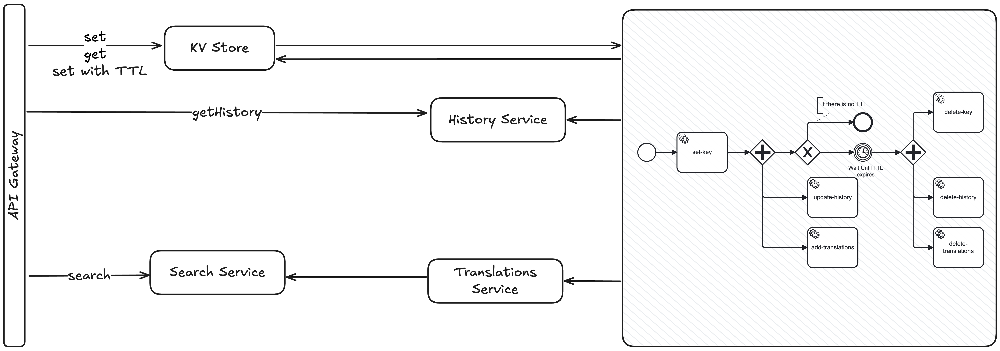

# flowcrux

Suppose you are building a product - the key value store for planet Earth, you call it. You want it
to have every feature you can think of:

- Key value storage persistence
- Viewing history of keys
- Searching keys, even in multiple languages

A system like this can be implemented in as micro services, because they provide many benefits:

- Low coupling between primary storage and history tracking
- Independent scaling and deploying
- Speed of development
- Heterogeneous technology stacks
- etc


Then a new feature comes along: setting a key with a TTL (time to live), or automatic deletion. This
creates a problem - which micro services do you need to involve in this automatic deletion? Kafka,
which was acting the data-bus, now needs to act as the control-bus too.

But there is a bigger problem - a micro service based architecture like this fragments the
semantics of the system. Once a message is sent into Kafka, its trajectory is completely lost to the
sender, which makes great sense in many cases but makes the system immensely difficult to
understand -- not just for non-technical folks, but also for engineers.

As engineers, our every-day world is mostly dealing with who depend on us, and who we depend on. We
end up focusing on the point-to-point communications and lose track of the global picture. In the
image below, if we own the green dot, the blue dots are what we are aware of, which may only be a
small part of the larger story.


So when the feature comes along (like the one to add TTLs to keys and values), it mandates us to go
back to the drawing board and re-learn the life of a request. And this repeats for every feature.

What if there was a better way? To talk about the semantics of what we are building without the
semantic fragmentation that microservices inherently brings? What if there was a system that allows
micro-servies to understand the whole story they play a part in?

The answer, I would argue is a semantic layer that orchestrates micro services, expressed as a
diagram.



In the above diagram - the big box on the right is an orchestration layer. But unlike durable
execution frameworks (or workflow engines), it focuses a lot on the expression of the flows using an
open standard notation called BPMN (Business Process Model and Notation). It includes many
orchestration features like callbacks, retries, fork/join etc.

But fundamentally, a diagram driven orchestration layer can help increase organizational cohesion.
Ultimately we cannot improve what we do not understand. In a decentralized world anything that
brings pieces together to form a cohesive mental model is powerful.

# Running the system

The following will start the server on port 9818. There is an
included [Swagger UI](http://localhost:9818/swagger-ui/index.html).

```
mvn clean && mvn spring-boot:run
```

# Running Camunda

```bash
docker compose up
```

Most of
the [login credentials](https://docs.camunda.io/docs/self-managed/setup/deploy/local/docker-compose/?cli=without)
are

- Login: demo
- Password: demo

### Connecting to PostgreSQL

```bash
docker exec -it postgres_flowcrux psql -U mourjo -d flowcrux_db 
```

### Creating a Kafka topic

```bash
docker exec -it flowcrux_kafka_broker /bin/kafka-topics --create --topic flowcrux_ops --bootstrap-server flowcrux_kafka_broker:29092 
```

### Producing to a Kafka topic

```bash
docker exec -it flowcrux_kafka_broker /bin/kafka-console-producer --bootstrap-server flowcrux_kafka_broker:29092 --topic flowcrux_ops
```

### Consuming from a Kafka topic

```bash 
docker exec -it flowcrux_kafka_broker /bin/kafka-console-consumer --bootstrap-server flowcrux_kafka_broker:29092 --topic flowcrux_ops
 ```
